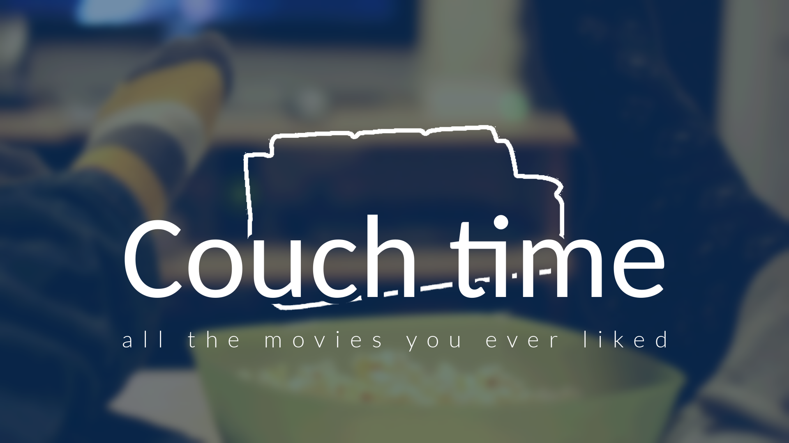

# couchtime-cnkt-
  

A proof of concept 

[Wiki -- Api documentation](https://github.com/xavrb/couchtime-cnkt/wiki)  

# What is couch Time 

We all at some point ever wanted to log every movie we liked -- wether you are a fan of Back to the future or maybe Silence of the lambs, even Twilight (no judgement here), it doesn't matter -- so we can talk to our friends on the next party or just to collect watched movies. Enter Couch Time.  
It’s a simple API and implementation developed in Python Django as a proof of concept  — a technical test, where an user can log their fav movies.  

## What can I do on CT

You can:  

* Register with a name and mail.  
* Save movies (name, genre, cast, director, year, etc) in a imdb-ish way.  
* Comment on a saved movie.  
* Rate a movie `1-5`  
* Delete movies  
* Search for movies  

Operations are available through a developed API.  

## To do  
* Authentication method  
* Validations  
* Guidelines and good practices 
* A [git repo](https://github.com/xavrb/couchtime-cnkt)  
* TDD  
* Use of a dbms 

## Will I be hired?
Yes.  

## Licence

This is licensed under GPL3.  
